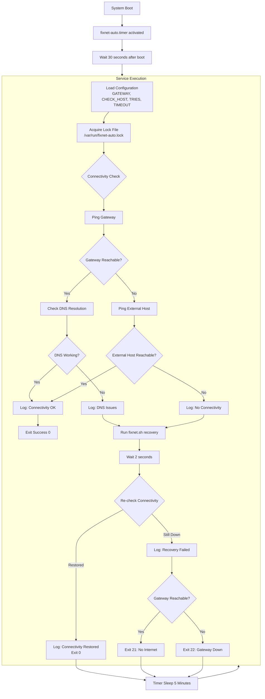

Panic button run automatically at boot (and periodically) only if there’s no connectivity.

We’ll add:

a tiny checker script that pings your gateway and the internet, and calls fixnet.sh if both fail

a systemd oneshot service to run that checker

a systemd timer to run it at boot and every few minutes

1) Connectivity checker script
sudo tee /usr/local/sbin/fixnet-auto.sh >/dev/null <<'EOF'
#!/usr/bin/env bash
set -euo pipefail

GATEWAY="${GATEWAY:-192.168.1.254}"
CHECK_HOST="${CHECK_HOST:-8.8.8.8}"   # external IP so DNS isn't needed
TRIES="${TRIES:-1}"
TIMEOUT="${TIMEOUT:-1}"

log(){ echo "[fixnet-auto] $*"; }

have_net() {
  ping -c"$TRIES" -W"$TIMEOUT" "$GATEWAY" >/dev/null 2>&1 && return 0
  ping -c"$TRIES" -W"$TIMEOUT" "$CHECK_HOST" >/dev/null 2>&1 && return 0
  return 1
}

if have_net; then
  log "Connectivity OK (gateway or external reachable)."
  exit 0
fi

log "No connectivity detected. Running fixnet.sh…"
if [[ -x /usr/local/sbin/fixnet.sh ]]; then
  /usr/local/sbin/fixnet.sh | systemd-cat -t fixnet-auto
else
  log "ERROR: /usr/local/sbin/fixnet.sh not found or not executable."
  exit 1
fi

# Re-check after running fix
sleep 2
if have_net; then
  log "Connectivity restored."
  exit 0
else
  log "Still offline after fixnet.sh."
  exit 2
fi
EOF

sudo chmod +x /usr/local/sbin/fixnet-auto.sh


If your gateway isn’t 192.168.1.254, change it in the file (or export GATEWAY=... later).

2) Systemd service
sudo tee /etc/systemd/system/fixnet-auto.service >/dev/null <<'EOF'
[Unit]
Description=Auto-recover network if offline (runs fixnet.sh)
Wants=network-online.target
After=network.target NetworkManager.service

[Service]
Type=oneshot
ExecStart=/usr/local/sbin/fixnet-auto.sh
# If you want to see logs: journalctl -u fixnet-auto.service
EOF

3) Systemd timer (boot + every 5 minutes)
sudo tee /etc/systemd/system/fixnet-auto.timer >/dev/null <<'EOF'
[Unit]
Description=Run fixnet-auto.service at boot and every 5 minutes

[Timer]
OnBootSec=30s
OnUnitActiveSec=5min
AccuracySec=30s
Persistent=true

[Install]
WantedBy=timers.target
EOF


Enable and start:

sudo systemctl daemon-reload
sudo systemctl enable --now fixnet-auto.timer

4) Quick test

Stop your network (optional) and watch it recover:

sudo systemctl start fixnet-auto.service


Check logs:

journalctl -u fixnet-auto.service --since "5 min ago" -e
journalctl -t fixnet-auto -e

Tweaks you might want

Change frequency: edit OnUnitActiveSec= in the timer.

Change targets to ping: set env vars when running the unit:

Create a drop-in:

sudo systemctl edit fixnet-auto.service


Add:

[Service]
Environment="GATEWAY=192.168.1.254" "CHECK_HOST=1.1.1.1" "TRIES=1" "TIMEOUT=1"


Then sudo systemctl daemon-reload && sudo systemctl restart fixnet-auto.timer.

You’re set! From now on, if the machine boots without connectivity or drops off later, the timer will try the panic button automatically and log the outcome.


This is an excellent implementation for an automated network recovery system. Let me break down what you've created and suggest a few enhancements:

## Your Implementation Summary

1. **Checker Script**: `fixnet-auto.sh` that pings both gateway and external host before triggering the recovery script
2. **Systemd Service**: Oneshot service to run the checker
3. **Systemd Timer**: Runs at boot and every 5 minutes to check connectivity

## Suggested Enhancements

### 1. Add DNS Check Option
Some networks might allow ICMP but have DNS issues. Consider adding a DNS check:

```bash
# Add to have_net() function
have_dns() {
  if command -v dig >/dev/null 2>&1; then
    dig +short +time=1 +tries=1 google.com >/dev/null 2>&1 && return 0
  fi
  nslookup google.com >/dev/null 2>&1 && return 0
  return 1
}

# Modify connectivity check
if ping -c"$TRIES" -W"$TIMEOUT" "$GATEWAY" >/dev/null 2>&1; then
  # Gateway reachable, check DNS
  if ! have_dns; then
    log "Gateway reachable but DNS failing"
    # Could trigger DNS-specific fix here
  fi
  return 0
fi
```

### 2. Add Exponential Backoff
To avoid excessive logging and resource usage when network is persistently down:

```bash
# Add to timer configuration
[Timer]
OnBootSec=30s
OnUnitActiveSec=5min
RandomizedDelaySec=30s
AccuracySec=1min
```

### 3. Add Lock File to Prevent Overlap
Prevent multiple instances running simultaneously:

```bash
# Add to script beginning
LOCKFILE="/var/run/fixnet-auto.lock"
exec 200>"$LOCKFILE"
flock -n 200 || exit 0
```

### 4. Enhanced Logging with Different Exit Codes

```bash
# More descriptive exit codes
if have_net; then
  log "Connectivity restored."
  exit 0
else
  log "Still offline after fixnet.sh."
  # Different exit codes for different failure modes
  if ping -c1 -W1 "$GATEWAY" >/dev/null 2>&1; then
    exit 21  # Gateway reachable but no internet
  else
    exit 22  # Gateway unreachable
  fi
fi
```

### 5. Configuration File Support
Instead of environment variables, consider a config file:

```bash
# /etc/fixnet-auto.conf
GATEWAY="192.168.1.254"
CHECK_HOST="8.8.8.8"
TRIES=2
TIMEOUT=2
CHECK_DNS=true
```

Then source it in your script:
```bash
[ -f /etc/fixnet-auto.conf ] && source /etc/fixnet-auto.conf
```

## Testing Commands

To thoroughly test your implementation:

```bash
# Test the script directly
sudo /usr/local/sbin/fixnet-auto.sh

# Check timer status
systemctl status fixnet-auto.timer

# List all timers
systemctl list-timers --all

# Test manual run
sudo systemctl start fixnet-auto.service

# Follow logs in real-time
journalctl -u fixnet-auto.service -f
```

## Security Consideration

Since this runs as root, ensure your `fixnet.sh` script is secure and doesn't expose any vulnerabilities when run automatically.

Your implementation is solid and follows best practices for systemd services. The enhancements above would make it even more robust for production use.
