```mermaid
flowchart TD
    PCI_Bus[PCI Bus Hierarchy]

    PCI_Bus --> Slot03[Slot 03.00 - Intel X540-AT2 10GbE]
    PCI_Bus --> Slot09[Slot 09.00 - Intel I211 1GbE]
    PCI_Bus --> Slot05[Slot 05.00 - NVMe SSD]
    PCI_Bus --> Slot0B[Slot 0B.00 - AMD Reserved]

    %% 10GbE Dual Port NIC
    Slot03 --> Port03_0[03:00.0 - Port 0]
    Slot03 --> Port03_1[03:00.1 - Port 1]

    Port03_0 --> Mem03_0_1[Memory: 7c22400000 2M prefetchable]
    Port03_0 --> Mem03_0_2[Memory: 7c22a04000 16K prefetchable]
    Port03_0 --> IRQ03_0[IRQ: 39]
    Port03_0 --> Driver03_0[Driver: ixgbe]

    Port03_1 --> Mem03_1_1[Memory: 7c22200000 2M prefetchable]
    Port03_1 --> Mem03_1_2[Memory: 7c22a00000 16K prefetchable]
    Port03_1 --> IRQ03_1[IRQ: 41]
    Port03_1 --> Driver03_1[Driver: ixgbe]

    %% 1GbE NIC
    Slot09 --> Port09_0[09:00.0 - Port 0]

    Port09_0 --> Mem09_0_1[Memory: fc600000 128K non-prefetchable]
    Port09_0 --> Mem09_0_2[Memory: fc620000 16K non-prefetchable]
    Port09_0 --> IOPorts09_0[I/O Ports: f000 disabled]
    Port09_0 --> IRQ09_0[IRQ: 24]
    Port09_0 --> Driver09_0[Driver: igb]

    %% NVMe Storage
    Slot05 --> NVMe05_0[05:00.0 - NVMe Controller]

    NVMe05_0 --> Vendor05_0[Vendor: Sandisk Corp]
    NVMe05_0 --> Model05_0[Model: WD Black 2018/SN750]
    NVMe05_0 --> Protocol05_0[Protocol: NVM Express 02]

    %% AMD Reserved
    Slot0B --> AMD0B_0[0B:00.0 - Reserved SPP]

    AMD0B_0 --> Vendor0B_0[Vendor: Advanced Micro Devices]
    AMD0B_0 --> Family0B_0[Family: Starship/Matisse]
    AMD0B_0 --> Class0B_0[Class: Non-Essential Instrumentation]

    %% Network Interface Mapping
    Driver03_0 --> Eth0[Interface: eth0/enp3s0f0]
    Eth0 --> Speed0[Speed: 10GbE]

    Driver03_1 --> Eth1[Interface: eth1/enp3s0f1]
    Eth1 --> Speed1[Speed: 10GbE]

    Driver09_0 --> Eth2[Interface: eth2/enp9s0]
    Eth2 --> Speed2[Speed: 1GbE]

    %% System Resources Summary
    IRQ03_0 --> IRQ_Summary[IRQ Lines: 24, 39, 41]
    IRQ03_1 --> IRQ_Summary
    IRQ09_0 --> IRQ_Summary

    Mem03_0_1 --> Mem_Summary[Memory Mapped I/O Regions]
    Mem03_0_2 --> Mem_Summary
    Mem03_1_1 --> Mem_Summary
    Mem03_1_2 --> Mem_Summary
    Mem09_0_1 --> Mem_Summary
    Mem09_0_2 --> Mem_Summary

    Driver03_0 --> Driver_Summary[Kernel Drivers: ixgbe, igb]
    Driver03_1 --> Driver_Summary
    Driver09_0 --> Driver_Summary

    %% Style Definitions
    classDef nic fill:#e3f2fd,stroke:#1976d2
    classDef storage fill:#f3e5f5,stroke:#7b1fa2
    classDef amd fill:#fff3e0,stroke:#f57c00
    classDef config fill:#f5f5f5,stroke:#9e9e9e
    classDef resource fill:#e8f5e8,stroke:#388e3c
    classDef interface fill:#ffebee,stroke:#d32f2f

    class Slot03,Port03_0,Port03_1 nic
    class Slot09,Port09_0 nic
    class Slot05,NVMe05_0 storage
    class Slot0B,AMD0B_0 amd
    class Mem03_0_1,Mem03_0_2,Mem03_1_1,Mem03_1_2,Mem09_0_1,Mem09_0_2,IOPorts09_0,IRQ03_0,IRQ03_1,IRQ09_0 config
    class Vendor05_0,Model05_0,Protocol05_0,Vendor0B_0,Family0B_0,Class0B_0 config
    class IRQ_Summary,Mem_Summary,Driver_Summary resource
    class Eth0,Eth1,Eth2,Speed0,Speed1,Speed2 interface
```

```
$ lspci -v | grep -A 10 -i ethernet
03:00.0 Ethernet controller: Intel Corporation Ethernet Controller 10-Gigabit X540-AT2 (rev 01)
	Subsystem: Inspur Electronic Information Industry Co., Ltd. 10G base-T DP EP102Ti3A Adapter
	Flags: bus master, fast devsel, latency 0, IRQ 39, IOMMU group 22
	Memory at 7c22400000 (64-bit, prefetchable) [size=2M]
	Memory at 7c22a04000 (64-bit, prefetchable) [size=16K]
	Capabilities: <access denied>
	Kernel driver in use: ixgbe
	Kernel modules: ixgbe

03:00.1 Ethernet controller: Intel Corporation Ethernet Controller 10-Gigabit X540-AT2 (rev 01)
	Subsystem: Inspur Electronic Information Industry Co., Ltd. 10G base-T DP EP102Ti3A Adapter
	Flags: bus master, fast devsel, latency 0, IRQ 41, IOMMU group 23
	Memory at 7c22200000 (64-bit, prefetchable) [size=2M]
	Memory at 7c22a00000 (64-bit, prefetchable) [size=16K]
	Capabilities: <access denied>
	Kernel driver in use: ixgbe
	Kernel modules: ixgbe

--
09:00.0 Ethernet controller: Intel Corporation I211 Gigabit Network Connection (rev 03)
	Subsystem: ASRock Incorporation I211 Gigabit Network Connection
	Flags: bus master, fast devsel, latency 0, IRQ 24, IOMMU group 27
	Memory at fc600000 (32-bit, non-prefetchable) [size=128K]
	I/O ports at f000 [disabled] [size=32]
	Memory at fc620000 (32-bit, non-prefetchable) [size=16K]
	Capabilities: <access denied>
	Kernel driver in use: igb
	Kernel modules: igb

0b:00.0 Non-Essential Instrumentation [1300]: Advanced Micro Devices, Inc. [AMD] Starship/Matisse Reserved SPP
```



