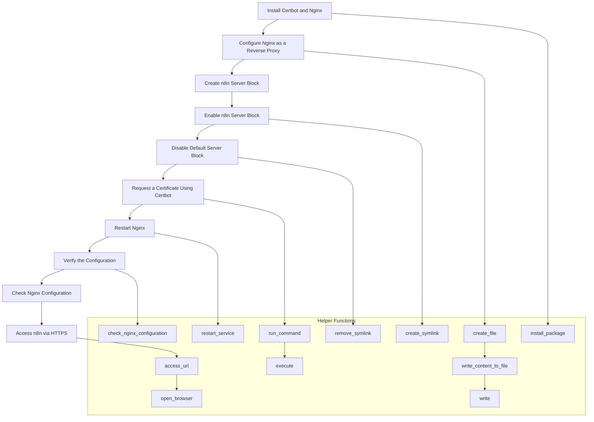

To run n8n using localhost with Ollama, you need to ensure that your n8n instance can communicate with the Ollama service. If you are running n8n in a Docker container and Ollama directly on your host machine, you might encounter connection issues due to Docker's network isolation.

Here are the steps to resolve this:

### 1. **Use Docker's Host Network**

If you are running n8n in Docker, you can use the host network mode to allow n8n to access services running on your host machine. You can start your n8n container with the `--network host` option.

```bash
docker run -d --network host --name n8n -v ~/.n8n:/home/node/.n8n n8nio/n8n
```

### 2. **Use `host.docker.internal`**

On Windows and Mac, Docker provides a special DNS name `host.docker.internal` that resolves to the internal IP address used by the host. You can use this address to access services running on your host machine from within a Docker container.

#### Example:

If Ollama is running on `localhost:11434`, you can access it from n8n using `http://host.docker.internal:11434`.

### 3. **Check Docker IP Address**

If the above methods do not work, you can manually find the Docker container's IP address and use it to connect to Ollama. You can find the IP address by running `docker inspect <container_id>` and looking for the `"IPAddress"` field.

```bash
docker inspect <container_id> | grep "IPAddress"
```

### 4. **Configure `.env` File**

Ensure your `.env` file is correctly set up to allow n8n to bind to the correct host and port. For example:

```plaintext
N8N_HOST=0.0.0.0
N8N_PORT=5678
N8N_PROTOCOL=http
```

This configuration allows n8n to be accessible from any network interface on your machine.

### 5. **Run n8n with Docker**

If you are running n8n in Docker, you can start the container with the necessary environment variables:

```bash
docker run -d --name n8n \
  -e N8N_HOST=0.0.0.0 \
  -e N8N_PORT=5678 \
  -e N8N_PROTOCOL=http \
  -v ~/.n8n:/home/node/.n8n \
  n8nio/n8n
```

### 6. **Access n8n and Ollama**

- **n8n**: Access n8n at `http://localhost:5678`.
- **Ollama**: If Ollama is running on `localhost:11434`, you can access it from n8n using `http://host.docker.internal:11434` or the IP address of the Docker container.

### Summary

1. **Use Docker's Host Network**:
   ```bash
   docker run -d --network host --name n8n -v ~/.n8n:/home/node/.n8n n8nio/n8n
   ```

2. **Use `host.docker.internal`**:
   - Access Ollama at `http://host.docker.internal:11434`.

3. **Check Docker IP Address**:
   ```bash
   docker inspect <container_id> | grep "IPAddress"
   ```

4. **Configure `.env` File**:
   ```plaintext
   N8N_HOST=0.0.0.0
   N8N_PORT=5678
   N8N_PROTOCOL=http
   ```

5. **Run n8n with Docker**:
   ```bash
   docker run -d --name n8n \
     -e N8N_HOST=0.0.0.0 \
     -e N8N_PORT=5678 \
     -e N8N_PROTOCOL=http \
     -v ~/.n8n:/home/node/.n8n \
     n8nio/n8n
   ```

By following these steps, you should be able to run n8n using localhost with Ollama successfully.

**Additional Information:**

### **Port Forwarding**

If you want to access your n8n instance from another device on the same network or remotely, you can use port forwarding.

1. **Find your local IP address**: You can find your local IP address by running `ifconfig` (Linux) or using the Network and Sharing Center in Windows.
2. **Forward the port**: Forward the port that n8n is listening on (e.g., 5678) to your local IP address. The process for doing this varies depending on your router, so you'll need to consult your router's documentation.

After forwarding the port, you should be able to access your n8n instance using your public IP address or dynamic DNS hostname followed by the forwarded port (e.g., `http://<public_ip>:5678` or `http://<dynamic_dns_hostname>:5678`).

### **HTTPS with Let's Encrypt**

To enable HTTPS for your n8n instance, you can use Certbot (Let's Encrypt) along with a reverse proxy like Nginx. Here are the steps to follow:

1. **Install Certbot and Nginx**:
   - On Ubuntu/Debian: `sudo apt install certbot nginx`
   - On other distributions, use the appropriate package manager.

2. **Configure Nginx as a reverse proxy**: Create a new server block for n8n in `/etc/nginx/sites-available/n8n` with the following content:

```nginx
server {
  listen 80;
  server_name <your_domain_or_ip>;
  location / {
    proxy_pass http://localhost:5678;
    proxy_set_header Host $host;
    proxy_set_header X-Real-IP $remote_addr;
  }
}
```

Replace `<your_domain_or_ip>` with your domain name or IP address.

3. **Enable the new server block and disable the default one**:
   - Enable the n8n server block: `sudo ln -s /etc/nginx/sites-available/n8n /etc/nginx/sites-enabled/`
   - Disable the default server block: `sudo unlink /etc/nginx/sites-enabled/default`

4. **Request a certificate using Certbot**: Run the following command to request a certificate for your domain:

```bash
sudo certbot --nginx -d <your_domain>
```

5. **Restart Nginx** to apply the changes: `sudo systemctl restart nginx`.

After completing these steps, you should be able to access your n8n instance using HTTPS at `https://<your_domain_or_ip>`.

To enable HTTPS for your n8n instance using Certbot (Let's Encrypt) and Nginx as a reverse proxy, follow these detailed steps:

### 1. **Install Certbot and Nginx**

#### On Ubuntu/Debian:

```bash
sudo apt update
sudo apt install certbot python3-certbot-nginx nginx
```

#### On CentOS/RHEL:

```bash
sudo yum install epel-release
sudo yum install certbot python3-certbot-nginx nginx
```

### 2. **Configure Nginx as a Reverse Proxy**

1. **Create a new server block for n8n**:
   - Create a new configuration file for n8n in `/etc/nginx/sites-available/`:

     ```bash
     sudo nano /etc/nginx/sites-available/n8n
     ```

   - Add the following content to the file:

     ```nginx
     server {
       listen 80;
       server_name <your_domain_or_ip>;

       location / {
         proxy_pass http://localhost:5678;
         proxy_set_header Host $host;
         proxy_set_header X-Real-IP $remote_addr;
         proxy_set_header X-Forwarded-For $proxy_add_x_forwarded_for;
         proxy_set_header X-Forwarded-Proto $scheme;
       }
     }
     ```

   - Replace `<your_domain_or_ip>` with your domain name or IP address.

2. **Enable the new server block and disable the default one**:
   - Enable the n8n server block:

     ```bash
     sudo ln -s /etc/nginx/sites-available/n8n /etc/nginx/sites-enabled/
     ```

   - Disable the default server block:

     ```bash
     sudo unlink /etc/nginx/sites-enabled/default
     ```

### 3. **Request a Certificate Using Certbot**

1. **Run Certbot to obtain and install the certificate**:

   ```bash
   sudo certbot --nginx -d <your_domain>
   ```

   - Replace `<your_domain>` with your actual domain name.

2. **Follow the prompts**: Certbot will guide you through the process of obtaining and installing the certificate. It will automatically update your Nginx configuration to serve your site over HTTPS.

### 4. **Restart Nginx**

After completing the Certbot setup, restart Nginx to apply the changes:

```bash
sudo systemctl restart nginx
```

### 5. **Verify the Configuration**

1. **Check Nginx Configuration**:

   ```bash
   sudo nginx -t
   ```

   This command checks the syntax of your Nginx configuration files and ensures there are no errors.

2. **Access n8n via HTTPS**:

   Open a web browser and navigate to `https://<your_domain_or_ip>`. You should see your n8n instance running securely over HTTPS.

### Summary

1. **Install Certbot and Nginx**:
   ```bash
   sudo apt update
   sudo apt install certbot python3-certbot-nginx nginx
   ```

2. **Configure Nginx as a Reverse Proxy**:
   - Create a new server block for n8n:
     ```bash
     sudo nano /etc/nginx/sites-available/n8n
     ```
   - Add the configuration:
     ```nginx
     server {
       listen 80;
       server_name <your_domain_or_ip>;

       location / {
         proxy_pass http://localhost:5678;
         proxy_set_header Host $host;
         proxy_set_header X-Real-IP $remote_addr;
         proxy_set_header X-Forwarded-For $proxy_add_x_forwarded_for;
         proxy_set_header X-Forwarded-Proto $scheme;
       }
     }
     ```
   - Enable the n8n server block:
     ```bash
     sudo ln -s /etc/nginx/sites-available/n8n /etc/nginx/sites-enabled/
     ```
   - Disable the default server block:
     ```bash
     sudo unlink /etc/nginx/sites-enabled/default
     ```

3. **Request a Certificate Using Certbot**:
   ```bash
   sudo certbot --nginx -d <your_domain>
   ```

4. **Restart Nginx**:
   ```bash
   sudo systemctl restart nginx
   ```

5. **Verify the Configuration**:
   - Check Nginx configuration:
     ```bash
     sudo nginx -t
     ```
   - Access n8n via HTTPS: `https://<your_domain_or_ip>`.

By following these steps, you should be able to run n8n using localhost with Ollama and enable HTTPS for secure access using Certbot and Nginx.

Sure! Below is a pseudo code representation of the process from start to finish for hosting Ollama on Linux localhost, including setting up Nginx as a reverse proxy and enabling HTTPS with Certbot.

### Pseudo Code Output

```plaintext
# Step 1: Install Certbot and Nginx
install_package("certbot")
install_package("python3-certbot-nginx")
install_package("nginx")

# Step 2: Configure Nginx as a Reverse Proxy
create_file("/etc/nginx/sites-available/n8n", """
server {
  listen 80;
  server_name <your_domain_or_ip>;

  location / {
    proxy_pass http://localhost:5678;
    proxy_set_header Host $host;
    proxy_set_header X-Real-IP $remote_addr;
    proxy_set_header X-Forwarded-For $proxy_add_x_forwarded_for;
    proxy_set_header X-Forwarded-Proto $scheme;
  }
}
""")

create_symlink("/etc/nginx/sites-available/n8n", "/etc/nginx/sites-enabled/n8n")
remove_symlink("/etc/nginx/sites-enabled/default")

# Step 3: Request a Certificate Using Certbot
run_command("certbot --nginx -d <your_domain>")

# Step 4: Restart Nginx
restart_service("nginx")

# Step 5: Verify the Configuration
check_nginx_configuration()
access_url("https://<your_domain_or_ip>")

# Helper Functions
function install_package(package_name) {
  run_command("sudo apt update")
  run_command("sudo apt install -y " + package_name)
}

function create_file(file_path, content) {
  run_command("sudo nano " + file_path)
  write_content_to_file(file_path, content)
}

function create_symlink(source, target) {
  run_command("sudo ln -s " + source + " " + target)
}

function remove_symlink(target) {
  run_command("sudo unlink " + target)
}

function run_command(command) {
  print("Running command: " + command)
  execute(command)
}

function restart_service(service_name) {
  run_command("sudo systemctl restart " + service_name)
}

function check_nginx_configuration() {
  run_command("sudo nginx -t")
}

function access_url(url) {
  print("Accessing URL: " + url)
  open_browser(url)
}

function write_content_to_file(file_path, content) {
  print("Writing content to file: " + file_path)
  write(file_path, content)
}

function open_browser(url) {
  print("Opening browser to: " + url)
  # Simulate opening a browser
}

function execute(command) {
  # Simulate executing a command
  print("Executing: " + command)
}

function write(file_path, content) {
  # Simulate writing content to a file
  print("Writing content to: " + file_path)
}
```

### Explanation

1. **Install Certbot and Nginx**:
   - Install the necessary packages using `install_package`.

2. **Configure Nginx as a Reverse Proxy**:
   - Create a new server block for n8n in `/etc/nginx/sites-available/n8n`.
   - Enable the n8n server block by creating a symlink.
   - Disable the default server block.

3. **Request a Certificate Using Certbot**:
   - Run Certbot to obtain and install the certificate.

4. **Restart Nginx**:
   - Restart the Nginx service to apply the changes.

5. **Verify the Configuration**:
   - Check the Nginx configuration for syntax errors.
   - Access the n8n instance via HTTPS to verify it is working.

### Helper Functions

- **install_package**: Installs a package using `apt`.
- **create_file**: Creates a file with the specified content.
- **create_symlink**: Creates a symlink.
- **remove_symlink**: Removes a symlink.
- **run_command**: Executes a command.
- **restart_service**: Restarts a service.
- **check_nginx_configuration**: Checks the Nginx configuration for syntax errors.
- **access_url**: Simulates accessing a URL in a browser.
- **write_content_to_file**: Writes content to a file.
- **open_browser**: Simulates opening a browser.
- **execute**: Simulates executing a command.
- **write**: Simulates writing content to a file.

This pseudo code provides a high-level overview of the steps involved in setting up Ollama on Linux localhost with Nginx and HTTPS using Certbot.
