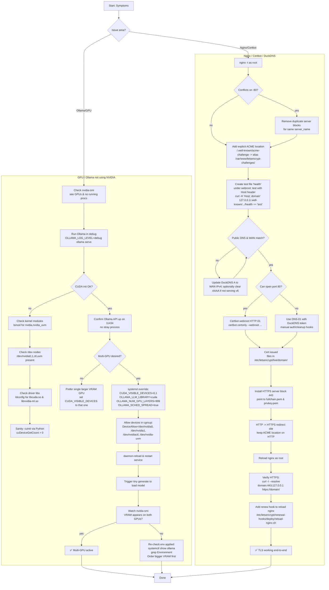

What we troubleshot (in rough order)
Ollama not using GPU

CUDA init failing inside Ollama with error 999 (“unknown error”) → typically driver/lib or device node/permissions issue. 
NVIDIA Developer Forums
+1

Verified CUDA stack works outside Ollama (cuInit(0) OK via Python).

Found a stale Ollama process binding 11434; killed it and restarted clean.

Confirmed NVIDIA modules & /dev nodes present (nvidia, nvidia_uvm, nvidia0/1, nvidiactl).

Ensured runtime libs present (libcuda.so, libnvidia-ml.so, libcublas.so).

Reinstalled Ollama, ran foreground with debug to see CUDA probing.

Systemd service env not exposing GPUs properly → fixed CUDA_VISIBLE_DEVICES + permissions.

Device cgroup lacked /dev/nvidia1 → added DeviceAllow=/dev/nvidia1 rwm.

Enabled multi-GPU spread with OLLAMA_SCHED_SPREAD=true. (Off by default; makes Ollama use all visible adapters.) 
HOSTKEY — premium web services provider
GitHub

OpenWebUI / Nginx / Certbot

Duplicate nginx vhosts for the same hostname on :80 → “conflicting server name … ignored”.

ACME challenge got proxied to app → 404; fixed with explicit webroot location for /.well-known/acme-challenge. 
eff-certbot.readthedocs.io
certbot.eff.org

DuckDNS showed A/AAAA mismatch vs actual WAN IP; Let’s Encrypt was validating the wrong address.

Used DNS-01 with DuckDNS TXT API to issue a cert (no ports required). 
duckdns.org

nginx -t as non-root failed to read LE private key (expected; run with sudo).

Added deploy hook to reload nginx on renewal.

one-liners you’ll reuse
Expose + spread across both GPUs (systemd override):

ini
Copy
Edit
[Service]
Environment=CUDA_DEVICE_ORDER=PCI_BUS_ID
Environment=CUDA_VISIBLE_DEVICES=0,1
Environment=OLLAMA_LLM_LIBRARY=cuda
Environment=OLLAMA_NO_CUDA=0
Environment=OLLAMA_NUM_GPU_LAYERS=999
Environment=OLLAMA_SCHED_SPREAD=true
DeviceAllow=/dev/nvidiactl rwm
DeviceAllow=/dev/nvidia-uvm rwm
DeviceAllow=/dev/nvidia0 rwm
DeviceAllow=/dev/nvidia1 rwm
nginx
Copy
Edit
sudo systemctl daemon-reload && sudo systemctl restart ollama
Check who owns 11434 (kill a stray Ollama):

bash
Copy
Edit
sudo ss -lptn 'sport = :11434'; sudo lsof -i :11434
pkill -f 'ollama serve' || true
DuckDNS update (A & clear AAAA):

bash
Copy
Edit
curl -fsS "https://www.duckdns.org/update?domains=ryleh-openweb,ryleh-forum&token=YOURTOKEN&ip="
curl -fsS "https://www.duckdns.org/update?domains=ryleh-openweb,ryleh-forum&token=YOURTOKEN&ipv6="

From start to finish, you successfully navigated a common but tricky deployment process:

Diagnosed Failure: You identified that the initial http-01 challenge was failing because your server is behind a NAT/CGNAT.

Changed Strategy: You correctly switched to the dns-01 challenge, which is the standard solution for this scenario.

Automated DNS: You implemented the duckdns-auth.sh and duckdns-clean.sh hook scripts to automate the DNS validation.

Solved Permissions: You fixed the final "Permission denied" error by using sudo to test and reload the Nginx configuration.
