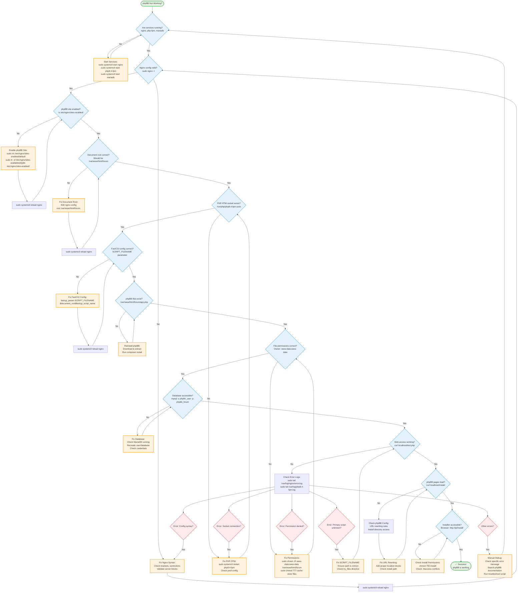

This troubleshooting flowchart maps out the exact debugging process we went through, but in a systematic visual format! Here's how to use it:
How to Follow the Decision Tree:
Start at the Top:

Begin with "phpBB Not Working?" and follow the yes/no paths
Each blue diamond is a check/question
Each orange rectangle is an action to take
Each red diamond is a specific error condition

Key Decision Points:

Services Running - Always check this first
Nginx Config Valid - Use sudo nginx -t
Site Enabled - Ensure only phpBB site is active
Document Root - Must point to /var/www/html/forum
PHP Socket - Check /run/php/php8.4-fpm.sock
FastCGI Config - The SCRIPT_FILENAME parameter that caused us trouble

Common Error Paths:

"Primary script unknown" → Fix SCRIPT_FILENAME parameter
"Permission denied" → Fix file ownership/permissions
Socket errors → Restart PHP-FPM
Config errors → Fix nginx syntax

Integration with Scripts:
You can use this flowchart alongside the troubleshooting script:
bash# Run specific checks based on where you are in the tree
sudo bash phpbb_troubleshoot.sh --services    # Services check
sudo bash phpbb_troubleshoot.sh --nginx       # Nginx config check
sudo bash phpbb_troubleshoot.sh --permissions # Permission check
sudo bash phpbb_troubleshoot.sh --web         # Web access test
This visual guide would have saved us a lot of time during our debugging session - it shows exactly which path to take based on each test result, and includes all the specific commands needed to fix each issue we encountered!
